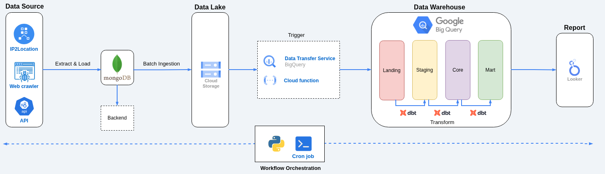
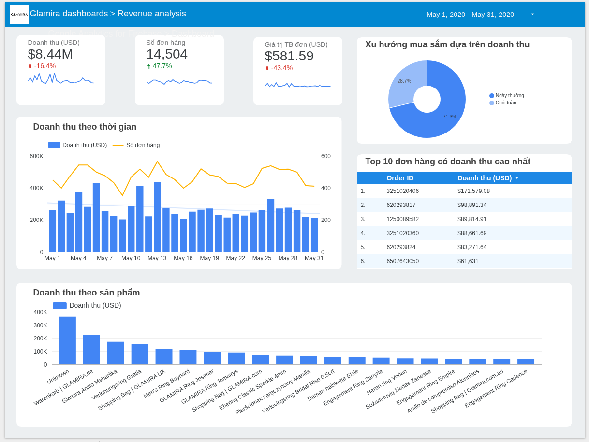
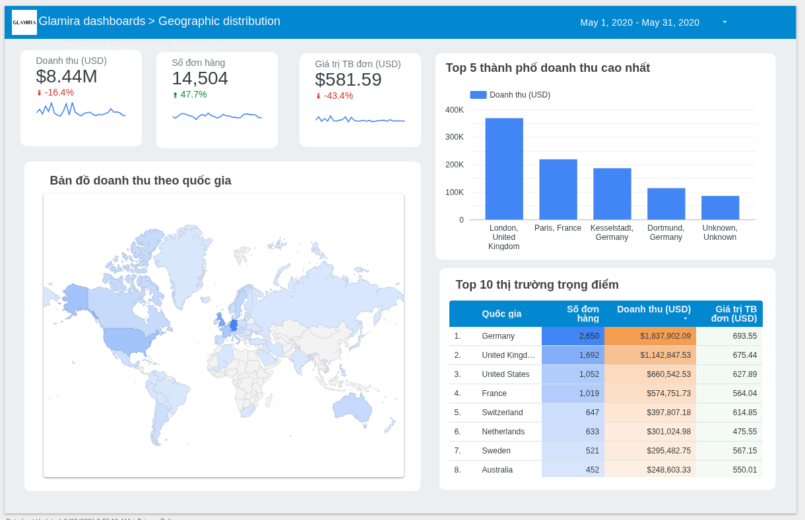
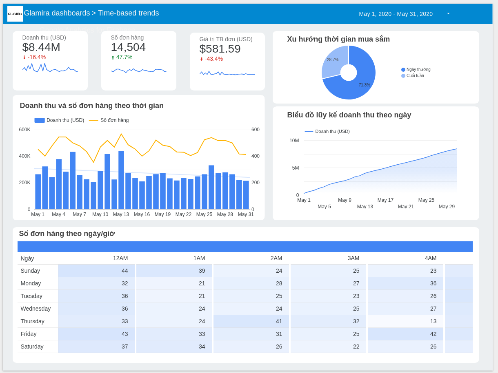
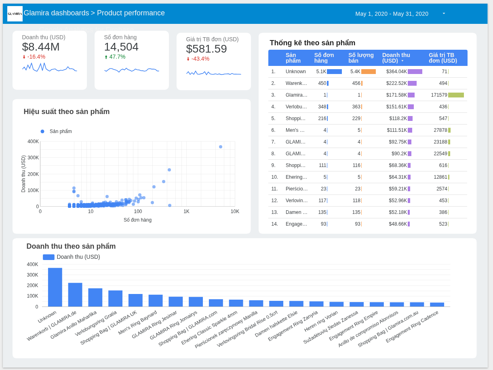

# Project E-Commerce ELT Pipeline

## Project Overview
* The E-Commerce ELT Pipeline is a comprehensive Data Pipeline (ELT) designed for the e-commerce company Glamira to automate the Extraction, Transformation, and Loading of user behavioral data and product information from their systems. 

* The project not only features a Crawler module equipped with robust Anti-Bot mechanisms and automated Checkpointing capabilities but also expands its big data processing capacity by standardizing to the Avro format, integrating with Google Cloud Storage (GCS) as a Data Lake, and building a Data Warehouse in Google BigQuery to support analytical workloads. 
* Furthermore, the project utilizes dbt (data build tool) to design a Star Schema data model, which is then visualized into in-depth interactive reports on Looker Studio.
---
## Overall Architecture


The project's architecture is designed according to modern **ELT (Extract, Load, Transform)** standards, leveraging the computing power of the Cloud Data Warehouse. The data flow is divided into the following main stages:

**1. Data Extraction**
*   **Web Crawler & API:** A custom-built Python Crawler system automatically collects user behavioral data and product information from websites/APIs.
*   **IP2Location:** Integrates the IP2Location dataset to enrich the data, mapping user IPs to specific geographic information (Country, City).
*   **MongoDB (Operational DB):** All collected raw data is temporarily stored in MongoDB. It acts as a Backend database providing flexible support for JSON/NoSQL data structures.

**2. Batch Ingestion & Data Lake**
*   Data from MongoDB is periodically extracted (Batch Ingestion), standardized into the **Avro** format (optimizing storage size and preserving the schema), and uploaded to **Google Cloud Storage (GCS)**. GCS serves as the Data Lake, providing cost-effective historical data storage.

**3. Trigger & Data Loading**
*   **Cloud Functions / Data Transfer Service:** Acts as an automated bridge. Upon the arrival of new data in GCS, the system triggers the loading process, ingesting this data chunk directly into the **Landing Area** of **Google BigQuery**.

**4. Transformation & Data Modeling (with dbt)**
*   Instead of external processing, the entire Transformation process is executed in-place within BigQuery utilizing SQL power, orchestrated by **dbt (data build tool)**. The data flows through 4 standard layers:
    *   `Landing`: Raw data freshly ingested from GCS.
    *   `Staging`: Cleanses data, handles null values, and standardizes data types.
    *   `Core`: Constructs the Data Model following the **Star Schema** standard (Fact & Dimension tables).
    *   `Mart`: The Aggregated data layer, specifically tailored to address distinct business use cases and reporting needs.

**5. Reporting & Visualization**
*   **Looker Studio:** Connects directly to the `Mart` layer in BigQuery to generate real-time interactive BI Dashboards, providing actionable insights into revenue and customer behavior.

**6. Workflow Orchestration**
*   **Python & Cron Job:** The entire data lifecycle (from running the Crawler, uploading files to GCS, to triggering dbt models) is automatically scheduled and monitored via Python scripts combined with OS-level Cron Jobs, ensuring a seamless and uninterrupted pipeline execution.

---
## BI Dashboards
The final output of this Data Pipeline is a suite of comprehensive Dashboards that analyze shopping behavior and Glamira's business performance across multiple dimensions.

**[Access the dashboard here](https://lookerstudio.google.com/reporting/5ec34374-165a-4891-b14d-b1acec65298c/page/t4asF)**

### 1. Revenue Analysis
* **Objective:** Evaluate the overall financial picture and key revenue drivers.
* **Business Insights:** Track core metrics (Revenue, Order Count, AOV) across time and products. Breakdown revenue distribution between weekdays and weekends to analyze shopping behavior. Additionally, identify and monitor high-value outlier orders via the Top Orders leaderboard.
* **Report Snapshot:**


### 2. Geographic Distribution
* **Objective:** Identify "Cash Cow" markets and evaluate global market penetration.
* **Business Insights:** Visualize revenue streams on a global Geo Map, integrated with Drill-down capabilities from the Country level down to individual Cities. Enables Regional Managers to cross-compare performance, order volume, and Average Order Value (AOV) across strategic territories.
* **Report Snapshot:**


### 3. Time-based Trends
* **Objective:** Track goal completion progress (Run-rate) and detailed shopping patterns.
* **Business Insights:** Provide a holistic view of cash flow growth velocity through cumulative revenue charts. Integrates a Day/Hour heatmap table to pinpoint "Golden Hours" for closing sales, heavily supporting the Marketing team in allocating Ad budgets and launching Flash Sale campaigns.
* **Report Snapshot:**


### 4. Product Performance
* **Objective:** Dissect the product portfolio to determine the core basket of goods for optimizing Inventory & Sales Push strategies.
* **Business Insights:** Apply scatter plots to evaluate product performance, clearly classifying "hot" products versus underperforming ones. Monitor the list of Top Revenue-Generating Products combined with detailed statistical tables to assess the actual purchasing power of each product.
* **Report Snapshot:**

---
## Directory Structure

```text
ecommerce-ELT-pipeline/
    ├── config/
    │   ├── __init__.py
    │   └── get_mongo_connection.py      # Establishes connection to MongoDB
    ├── data/
    │   ├── raw/                         # Raw data (unprocessed)
    │   └── processed/                   # Output data and Checkpoint files
    │       ├── crawl_result/
    │       │   ├── error_404_productid.txt  # Log of Product IDs resulting in 404 errors
    │       │   ├── success_productid.txt    # Log of successfully crawled Product IDs (Checkpoint)
    │       │   └── product_names.csv        # CSV backup/log of crawl results
    │       └── avro_result/             # Data transformed into Avro format
    │           └── checkpoints/         # Checkpoint data for export processes
    ├── dbt_glamira/                     # Directory containing all Data Modeling logic (dbt)
    ├── etl/
    │   ├── extract/
    │   │   ├── __init__.py
    │   │   ├── product_crawler.py       # Script to crawl product names 
    │   ├── load/
    │   │   ├── __init__.py
    │   │   ├── export_to_bigquery.py    # Handles loading data from GCS to BigQuery
    │   │   ├── export_to_gcs.py         # Uploads Avro files to the Data Lake (GCS)
    │   │   └── trigger_bigquery_load.py # Trigger to initiate the Load process from GCS to BigQuery
    │   └── transform/
    │       ├── __init__.py
    │       └── ip_processing.py         # Script to standardize user IPs
    ├── src/                             # Auxiliary utility modules
    │   ├── __init__.py
    │   ├── checkpoint_manager.py        # Manages reading/writing Checkpoints
    │   ├── get_data_from_env.py         
    ├── tests/                           # Data Monitoring & Testing                  
    │   ├── __init__.py
    │   └── raw_data_profiling.sql       # SQL script to run profiling on BigQuery
    ├── .env                             # File containing environment variables
    ├── .gitignore                       # Files to ignore when pushing to Git
    ├── poetry.lock                      # Dependency versions lock file
    ├── pyproject.toml                   # Project configuration & library list (Poetry)
    └── README.md                        # Project documentation
```

---

## Key Features
1. Anti-Bot & Firewall Bypass Mechanisms (Bypass 403/429):

* Spoof TLS Fingerprints via the `curl_cffi` library (impersonating Chrome, Edge, Safari).

* Integrate a Proxy network (via webshare.io) for IP rotation to prevent IP blocking when running on GCP Virtual Machines.

2. Intelligent Process Management (Checkpointing):

* Implement a checkpointing method to store the status of processed data IDs in `data/processed/`. If the script is interrupted (due to power loss, network drop), the subsequent run will automatically skip completed IDs, maximizing time efficiency.

3. IP Location Processing & Standardization:

* Integrate the IP2Location library and scan local .BIN files to rapidly decode locations (Country, Region, City) without external API calls.

* Data Quality Control: Automatically filter out invalid IPs or those lacking location data (-, n/a, N/A).

4. Database Optimization (MongoDB):

* Automatic data batching (Cursor Batching) limited by batch_size(1000) ensures smooth processing of tens of thousands of records without crashing.

* Leverage Compound Indexes to accelerate data queries from `raw_data`.

5. Data Export & Cloud Integration (GCS & BigQuery):

* Data Lake (GCS): `export_to_gcs.py` automates the upload of standardized Avro files to cloud storage.

* Data Warehouse (BigQuery): The `export_to_bigquery.py` and `trigger_bigquery_load.py` scripts handle schema definition and load data from GCS into BigQuery, making it analytics-ready.

6. Testing & Data Monitoring:

* Add SQL scripts to test and profile the quality of data loaded into BigQuery.

* Use `raw_data_profiling.sql` to execute Data Profiling directly within BigQuery to evaluate data integrity and distribution post-load.

7. Data Modeling & Analytics (dbt & Looker):

* Apply dbt directly on top of BigQuery to transform raw data into a Data Mart, optimizing query costs.

* Provide real-time interactive Dashboards with powerful Cross-filtering capabilities.
---

## Setup & Configuration
1. System Requirements
* Operating System: Linux (Ubuntu/Debian) or MacOS.
* Python: >= 3.10
* Package Manager: Poetry

2. Install Virtual Environment and Dependencies
* The project uses Poetry for strict dependency management. Install the dependencies using the following commands:
```
# Force Poetry to create the .venv directory inside the project root
poetry config virtualenvs.in-project true

# Install all libraries from the pyproject.toml file
poetry install
```
3. Environment Variable Configuration (.env)
* Create a `.env` file in the root directory and declare the following parameters:
```
# MongoDB Configuration
MONGO_URI=mongodb+srv://<username>:<password>@cluster.mongodb.net/
DB_NAME='your_db'

# Log file path
PRODUCT_NAME_PATH='ecommerce-ELT-pipeline/data/processed/crawl_result/product_names.csv'

# IP data path
IP_DATA_PATH = "ecommerce-ELT-pipeline/data/raw/ip_data/IP-COUNTRY-REGION-CITY.BIN"

# Checkpoint file path
SUCCESS_FILE_PATH = 'ecommerce-ELT-pipeline/data/processed/crawl_result/success_productid.txt'
ERROR_404_FILE_PATH = 'ecommerce-ELT-pipeline/data/processed/crawl_result/error_404_productid.txt'

# Avro file path
AVRO_PATH = 'ecommerce-ELT-pipeline/data/processed/avro_result'

# GCP config
BUCKET_NAME = 'your_bucket'
# GCP key file path (delete if running on VM)
# GCP_KEY_FILE_PATH = 'ecommerce-ELT-pipeline/data/gcp_key/gcp_key.json'
```

4. Proxy Configuration (Required when running on the Cloud)
* Open the `etl/extract/product_crawler.py` file, locate the `proxy_list`, and update it with your proxy list (e.g., from Webshare) in the following format: *http://username:password@ip_address:port*
 
5. GCP Authorization:
* If running locally: Ensure you have downloaded the Service Account JSON file from the Google Cloud Console and placed it in the `data/gcp_key/` directory. Grant 'Storage Object Admin' and 'BigQuery Data Editor' roles to this Service Account.
* If running on a GCP VM: Ensure the VM uses a Service Account with 'Storage Object Admin' and 'BigQuery Data Editor' roles, and select the "Allow full access to all Cloud APIs" option for Access scopes.

6. Setup dbt Models:
* Refer to the `dbt_glamira/README.md` file for instructions on setting up dbt models.
---

## Execution Guide
1. Run Crawler to Collect Product Names
* To execute the web scraping script, navigate to the project's root directory and run via poetry:
```
poetry run python -m etl.extract.product_crawler
```
* Script Workflow:

  * Connects to MongoDB and retrieves the total number of IDs to crawl from the `raw_data` table.

  * Cross-references with `success_productid.txt` to exclude already completed IDs.

  * Divides tasks into small batches and utilizes Multi-threading combined with Proxy rotation.

  * Processes HTML parsing logic to extract product names.

  * Logs statuses in real-time to text files (Checkpointing), writes logs to a CSV, and saves cleaned data into the `product_names` Collection in MongoDB.

2. Run Transform for IP Location Processing
* To execute the IP localization script, navigate to the project's root directory and run via poetry:
```
poetry run python -m etl.transform.ip_processing
```

* Script Workflow:

  * Scans the `raw_data` collection and uses a Pipeline Aggregation to group Unique IPs.

  * Loads the local IP2Location `.BIN` database.

  * Performs matching and standardizes Data Quality (removing junk data and missing information).

  * Executes a Bulk Insert of the cleaned data into the `ip_locations` collection.

3. Transform and Export Data to GCS
* To execute the script for uploading data to GCS, navigate to the project's root directory and run via poetry:
```
poetry run python -m etl.load.export_to_gcs
```

4. Load Data from GCS into BigQuery
* To execute the script for loading data from GCS to BigQuery, navigate to the project's root directory and run via poetry:
```
poetry run python -m etl.load.export_to_bigquery
```

5. Trigger Automated GCS to BigQuery Load
* To execute the script for loading data from GCS to BigQuery, utilize Cloud Run functions and deploy the `trigger_bigquery_load.py` script.

6. Data Quality Checks on BigQuery
* Copy the content of the `tests/raw_data_profiling.sql` file and execute it in the BigQuery Workspace UI to view statistical metrics regarding Nulls, Duplicates, and data distribution.

7. Run dbt Models:
* Refer to the `dbt_glamira/README.md` file for instructions on running dbt models.
---

## Log Data Management (Process Reset)
* If you wish to restart the crawl process from scratch, delete the checkpoint files in the `processed/crawl_result` directory:
```
rm data/processed/crawl_result/*
```

* If you wish to restart the GCS export process from scratch, delete the checkpoint files in the `processed/avro_result/checkpoints` directory:
```
rm data/processed/avro_result/checkpoints/*
```
---

## Current Limitations

Despite optimizations, the project currently has certain constraints:
1. **Reliance on Free Proxies:** Due to using a free Datacenter Proxy tier (Webshare), the Crawler's bandwidth is throttled. When scraping large volumes of data, the system may return a `402 Payment Required` error.
2. **Sensitivity to HTML Structure:** The product name parsing logic is tightly coupled to the website's current HTML structure (e.g., `h1.page-title span`, `meta og:title` tags). If the website updates its UI, the BeautifulSoup functions may fail to capture the data.
3. **Static IP Data:** The IP Processing module relies on a local Database file (`.BIN`). Without frequent updates, newly allocated IP ranges might not be accurately identified.
4. **Lack of Automation & Scheduling:** Currently, the Pipeline is triggered manually via terminal commands on a Virtual Machine.

---

## Future Roadmap

To evolve this project into an Enterprise-level Data Platform, the following improvement steps are planned:

1. **Proxy Infrastructure Upgrade:** Transition to paid Rotating Residential Proxy services (e.g., BrightData, SmartProxy) or specialized Scraping APIs to boost crawl speeds (to 50-100 concurrent threads) and completely bypass 402/403 errors.
2. **Full Automation:** Migrate these scripts into workflow orchestration tools (like Apache Airflow) rather than relying on bash scripts/cronjobs to manage automated daily/weekly pipelines and handle automatic retries upon failure.
3. **Alerting System:** Integrate webhooks (Discord/Telegram) to automatically dispatch reports on error handling statuses.
4. **Serverless Deployment (Cloud Run):** Package ETL modules into Docker Containers and deploy them onto Google Cloud Run.