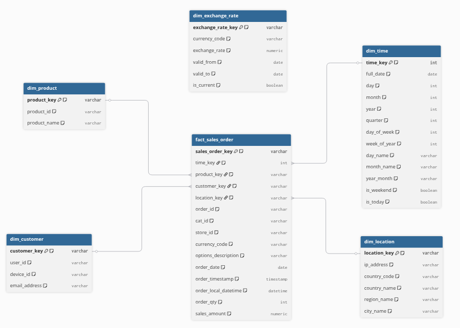

# dbt_glamira: Data Modeling & Technical Specification

## Introduction
The `dbt_glamira` directory contains the entire source code for Data Modeling using **dbt (data build tool)**.

The role of this module is to execute the **Transform (T)** step within the ELT pipeline: extracting raw data from BigQuery, cleansing and standardizing it, and building a Data Warehouse conforming to a Star Schema model, ready to serve BI Dashboards on Looker Studio.

---
## Directory Structure
```
dbt_glamira/
├── models/
│   ├── staging/                    # Staging layer: Contains views to clean raw data (rename columns, type casting). 1:1 ratio with source data.
│   │   ├── src_glamira.yml         # Declares mapping with the raw_layer_avro dataset on BigQuery
│   │   └── stg_config.yml          # Declares descriptions and unit tests for the staging layer
│   ├── core/                       # Core layer: Contains dim and fact tables connecting business logic and handling complex calculations.
│   │   └── core_config.yml         # Declares descriptions and unit tests for the core layer
│   └── mart/                       # Mart layer: Contains aggregated tables ready to be pushed to BI Tools/Looker for reporting.
│       └── mart_config.yml         # Declares descriptions and unit tests for the mart layer
├── macros/                         # Contains reusable Jinja/SQL code snippets.
│   └── generate_schema_name.sql    # Macro to automatically configure routing of staging/core/mart layers into separate BigQuery datasets. 
├── tests/                          # Contains custom Unit Tests to check data quality.
├── seeds/                          # Contains static mapping .csv files.
│   └── exchange_rates.csv          # Static mapping file containing currency exchange rates
├── snapshots/                      # Contains Snapshot definitions to track history (SCD Type 2)
│   └── snapshots_config.yml        # Declares descriptions and unit tests for snapshots
├── dbt_project.yml                 # File containing the project's routing configuration information.
├── packages.yml                    # Where supplementary dbt packages are declared.
├── package-lock.yml                # Dependency version lock file (auto-generated by dbt after running dbt deps).
├── .gitignore                      # Files to ignore when pushing to Git
└── README.md                       # This documentation file.
```
---

## Data Architecture


The data model is strictly divided into 3 physical layers, with automated schema routing configured via the `generate_schema_name` macro:

### 1. Staging Layer (`schema: staging` | `materialized: view`)
The pre-processing layer acting as the entry point for extracting and cleansing data from the source (`raw_layer_avro`).
* **`stg_raw_data`:** The core of the system. 
  * Handles the unnesting of complex JSON arrays (`cart_products`).
  * **Business Logic:** Standardizes the `price` column using Regex (removing junk characters, unifying decimal separators `.` and `,`) to safely cast it to `NUMERIC`.
  * Optimizes costs using Incremental Loads (only scanning data from the current and previous day).
* **`stg_exchange_rates`:** Processes the static configuration file (Seed), applying a Window Function (`LEAD`) to determine the expiration date (`valid_to`) for each exchange rate version.
* **`stg_ip_locations` & `stg_product_names`:** Standardizes column names for mapping with dimension tables.

### 2. Core Layer (`schema: core` | `materialized: table`)
The official Data Warehouse layer, designed according to the Star Schema model. Tables are linked using Surrogate Keys generated by the `dbt_utils` package.
* **Dimension Tables:**
  * `dim_customer`, `dim_location`, `dim_product`: Stores analytical attributes. Automatically handles Missing Data by generating default `'Unknown'` rows.
  * `dim_date`: A date table automatically generated using the `GENERATE_DATE_ARRAY` function, dissecting full analytical dimensions (Day of Week, Day, Month, Quarter, Year, Weekend).
  * `dim_exchange_rate`: Stores exchange rate history in an SCD (Slowly Changing Dimension) format.
* **Fact Table (`fact_sales_order`):**
  * An event table storing details of every product line item within an order.
  * Uses an Incremental Load with an `insert_overwrite` strategy and partitions by date (`partition_by order_date`).
  * The primary key is a composite of `order_id` + `product_id` + `ROW_NUMBER()` to completely eliminate the risk of duplicates.

### 3. Mart Layer (`schema: mart` | `materialized: table`)
The Data Mart layer that directly serves reports.
* **`mart_sales_analysis`:** A denormalized table consolidating all Dimensions into the Fact. Ensures Looker Studio only needs to query a single table to optimize performance.
* **Currency Conversion:** `sales_amount_usd`. 
  * Calculation: Original revenue (`sales_amount`) multiplied (`*`) by the exchange rate (`exchange_rate`).
  * **Exchange Rate Mapping Logic:** The rate is dynamically fetched based on the order execution date (`order_date` falls between `valid_from` and `valid_to` of the corresponding currency).

### 4. Snapshot Layer (schema: snapshots | materialized: snapshot)
This layer utilizes the SCD Type 2 (Slowly Changing Dimension) mechanism to not only store the current state but also retain the entire history of changes for an entity.

* **`snap_dim_customer`:** Tracks changes in customer information based on dual identification.
  * Identification Mechanism: Uses a Surrogate Key (`customer_key`) generated from a combination of `user_id` and `device_id`.
  * Strategy: Uses a timestamp based on the `last_updated_at` column (the time of the customer's last transaction).
  * Output Data: Appends dbt technical columns (`dbt_scd_id`, `dbt_valid_from`, `dbt_valid_to`) to facilitate querying data at any given point in the past.

---
## Installation Guide
1. System Requirements
* Python: >= 3.10
* Package Manager: Poetry
* A Google Cloud Platform (GCP) account with BigQuery access.

2. Service Account Setup (GCP Authentication)
* Ensure you have a JSON authentication key file specifically for dbt (e.g., `dbt-sa-key.json`).

3. Install Libraries
* At the root of the project, open the Terminal and run the following command for Poetry to read the `pyproject.toml` file and install `dbt-bigquery` along with related dependencies:
```
poetry install
```
4. Connection Configuration (profiles.yml)
Create or open the default system dbt configuration file at `~/.dbt/profiles.yml` and enter the following information:
```
    glamira_dbt:
      target: dev
      outputs:
        dev:
          type: bigquery
          method: service-account
          project: your-project-name
          dataset: your-project-dataset
          threads: 4
          keyfile: .../dbt-sa-key.json       # Path to the GCP authentication file
          location: your-data-location       # Must match the region hosting the Raw data
```
---
## Execution Guide 

For the dbt system to function, ensure your `profiles.yml` file is correctly pointed to your BigQuery Project.

**Step 1: Install auxiliary packages**
Download the `dbt_utils` package to support Surrogate Key generation.
```
dbt deps
```

**Step 2: Load static data (Seeds)**
Load the `exchange_rates.csv` file into BigQuery.
```
dbt seed
```

**Step 3: Initialize and update Snapshots**
Initialize and update all Snapshot models.
```
dbt snapshot
```

**Step 4: Compile and run Models**
Run the entire pipeline from Staging -> Core -> Mart.
```
dbt run
```

**Step 5: Test data**
Verify the Not Null, Unique, and Referential Integrity (Foreign Key) constraints defined in the `_config.yml` files.
```
dbt test
```